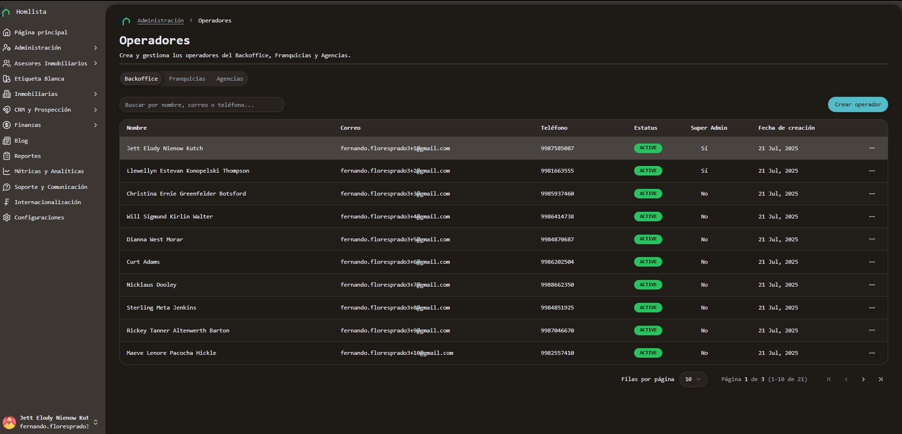
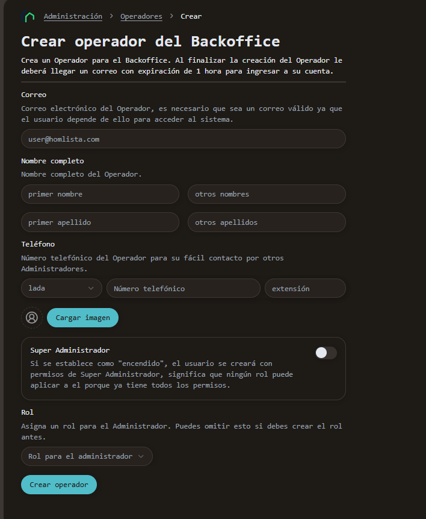
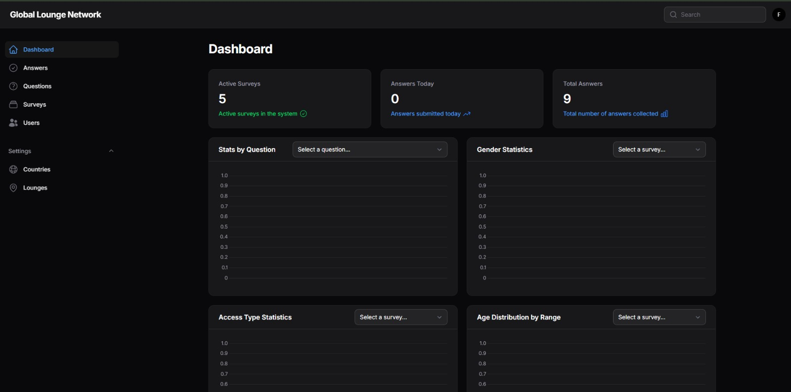
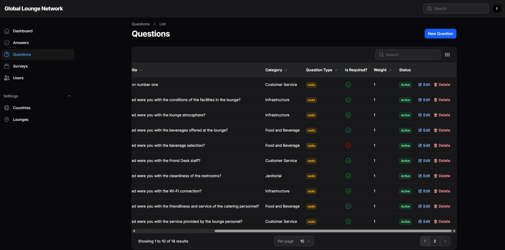
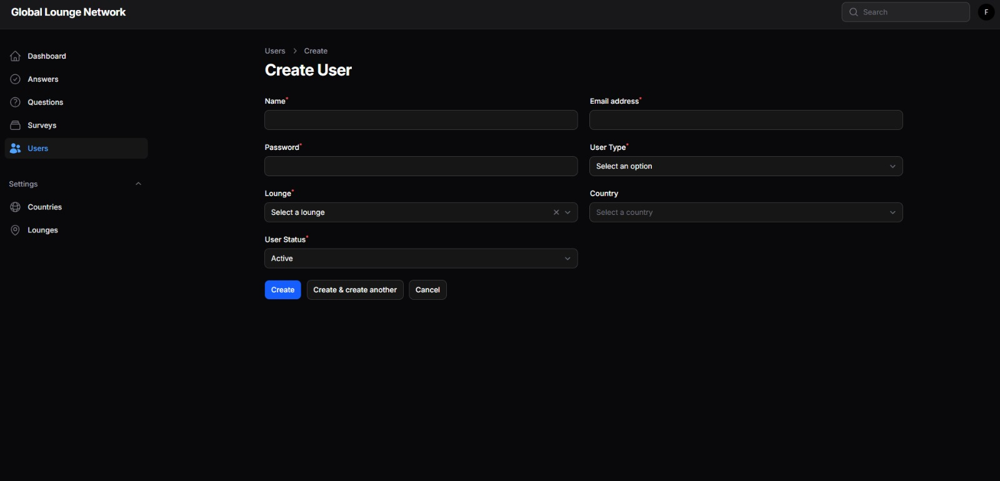

# ¡Hola, soy Fernando! 👋
### Software Engineer | Fullstack Developer | ML Enthusiast

Ingeniero de Software enfocado en el desarrollo de sistemas robustos, escalables y con un diseño orientado al usuario. Mi experiencia abarca desde la arquitectura de bases de datos complejas hasta la implementación de interfaces dinámicas y análisis de datos.

---

## 🛠️ Stack Tecnológico

| Categoría | Tecnologías |
| :--- | :--- |
| **Backend** | PHP (Laravel), MySQL, PostgreSQL |
| **Frontend** | React, JavaScript, Python, HTML5, TailwindCSS, Vite, CSS |
| **Herramientas** | Docker, Git, Figma, Notion |

---

## 🚀 Proyectos Destacados

### 🏠 1. Homlista - Plataforma Inmobiliaria (Backoffice)
*Optimización y gestión de datos a gran escala.*

> **Nota sobre Propiedad Intelectual:** Por políticas de confidencialidad y derechos de autor de la empresa, el código fuente y los archivos originales de Figma no son públicos. Se presentan capturas de pantalla de las vistas desarrolladas por mi autoría para demostrar las capacidades técnicas.

- **El Desafío:** Diseñar una arquitectura de base de datos capaz de manejar volúmenes masivos de información manteniendo una eficiencia total en las consultas y tiempos de respuesta.
- **Mi Contribución:**
    - **Arquitectura de Datos:** Diseño y normalización de la base de datos en **MySQL** para asegurar la integridad y rapidez del sistema.
    - **Desarrollo Fullstack:** Creación de flujos **CRUD** (Create, Read, Update, Delete) completos y funcionales utilizando **Laravel** y **React**.
    - **UI/UX:** Diseño y desarrollo de vistas críticas del Dashboard, priorizando la usabilidad para el manejo de inventario inmobiliario.
- **Stack:** PHP, Laravel, MySQL, React.

#### 📸 Evidencia Visual
*A continuación se muestran capturas de las interfaces en las que trabajé directamente:*
| Dashboard de Gestión | Flujo de Edición |
| :---: | :---: |
|  |  |

---

### 📊 2. Global Lounge Network - Survey System
*Digitalización y automatización de inteligencia de cliente.*

- **El Desafío:** La empresa carecía de un método moderno para recolectar satisfacción del cliente en tiempo real, lo que retrasaba la generación de reportes y la toma de decisiones estratégicas.
- **Mi Contribución (Desarrollo End-to-End):**
    - **Módulo de Encuestas:** Diseño y desarrollo de interfaces dinámicas para la captura de datos de usuario.
    - **Análisis de Datos:** Implementación de un sistema de procesamiento de datos que genera gráficas automáticas dentro del dashboard administrativo.
    - **Reporting:** Creación de funcionalidades para la exportación de métricas y propuestas de mejora basadas en los datos recolectados.
- **Logro:** Se automatizó el ciclo de feedback, reduciendo el tiempo de generación de reportes de días a segundos.
- **Stack:** PHP, Laravel, Blade, MySQL.

#### 📸 Galería del Proyecto

| 📝 Interfaz de Encuesta (Client-Side) | 📈 Dashboard Administrativo (Panel) |
| :---: | :---: |
|  |  |
| *Diseño minimalista enfocado en la tasa de finalización.* | *Visualización de métricas y reportes automáticos.* |

| ⚙️ Gestión de Datos | Gestión de Usuarios |
| :---: | :---: |
|  |  |
| *Manejo eficiente de flujos CRUD para administración.* | *Módulo de generación de estrategias basado en datos.* |

---

## 📫 Contacto & Redes
- 💼 **LinkedIn:** [linkedin.com/in/fernando-flores](https://linkedin.com)
- 📧 **Email:** fernando.floresprado3@gmail.com
- 🐙 **GitHub:** [@Fernando-FloresP](https://github.com/Fernando-FloresP)
